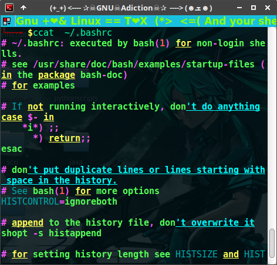
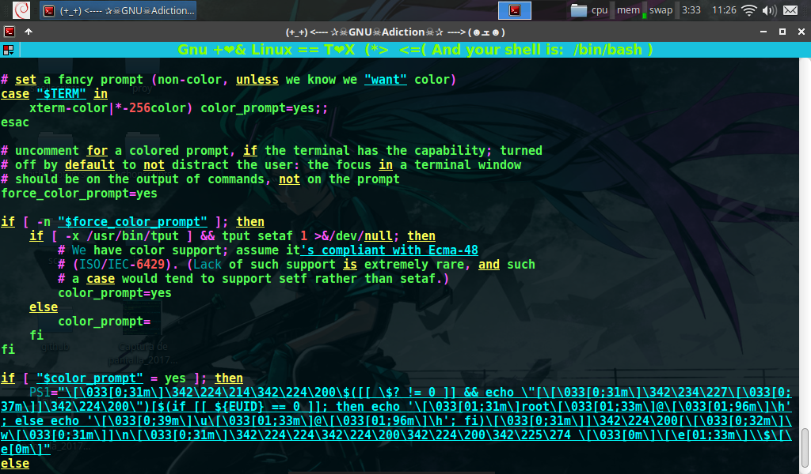
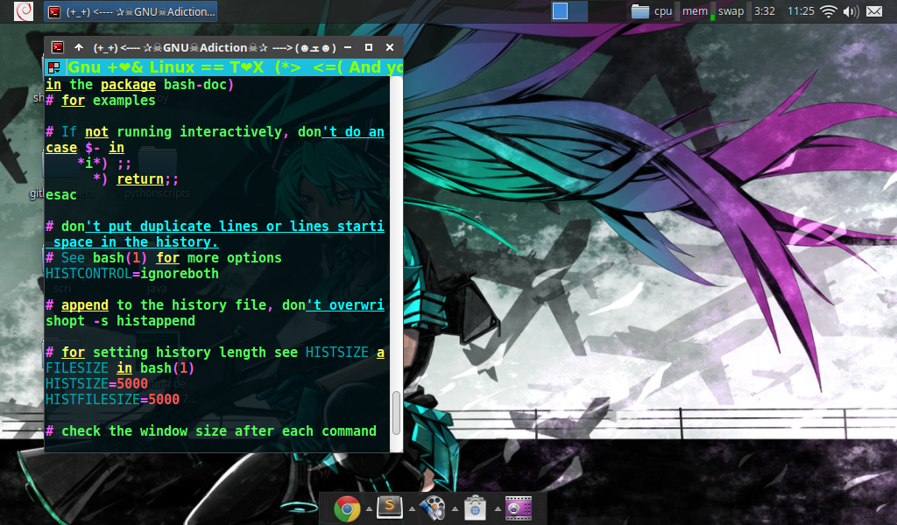

# (+_+) <----✰ ☠GNU☠Addiction☠✰ ----> (☻ܫ☻)
 
### *✰Perfect shuffle✰*

[**background image**](https://razgriz12991.deviantart.com/art/Vocaloid-Wallpaper-279294938) 

[**Terminator**](https://launchpad.net/terminator)

[**cmus**](https://github.com/TitanHero/cmus)

[**rainbowstream**](https://github.com/orakaro/rainbowstream) *(Twitter for terminal )*   **★excelent★** 

[**hero_theme**](https://github.com/TitanHero/hero_theme) *(Theme for cmus)*

[**prompt**](data/prompt_config) *(Prompt style of Parrot OS)*


(-‿◕)


### (⊙_◎) 


#### ====
### ==

# ☀ Colorized cat syntax highlighting using [**ccat**](https://github.com/jingweno/ccat)  (◑‿◐) ☀

### ==
#### ====

### Customize your cat output syntax with colors  (\*╭╮\*) ✄

Install [ccat](https://github.com/jingweno/ccat)  and then configure your favorite output colors or maybe you want to use my custom color config(screenshots) in that case run this script :(◕‿-)

Note:
*This configure my custom syntax highlighting with an alias over the same "ccat" command and write that alias config to `.bashrc` in the last line, for set by default.*

```shell
$ echo "alias ccat='ccat -G String=_white_ -G Keyword=_yellow_ -G Plaintext=green -G Punctuation=fuscia -G Decimal=red'" >> ~/.bashrc && source ~/.bashrc
```




**(★╭╮★)**



**(❤╭╮❤)**



### **(∩▂∩)** 


